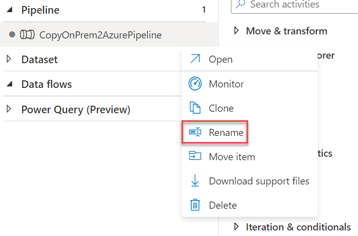

Big data analytics and visualization

Hands-on lab step-by-step

November 2022

Information in this document, including URL and other Internet Web site references, is subject to change without notice. Unless otherwise noted, the example companies, organizations, products, domain names, e-mail addresses, logos, people, places, and events depicted herein are fictitious, and no association with any real company, organization, product, domain name, e-mail address, logo, person, place or event is intended or should be inferred. Complying with all applicable copyright laws is the responsibility of the user. Without limiting the rights under copyright, no part of this document may be reproduced, stored in or introduced into a retrieval system, or transmitted in any form or by any means (electronic, mechanical, photocopying, recording, or otherwise), or for any purpose, without the express written permission of Microsoft Corporation.

**Contents**

<!-- TOC -->

- [Data analytics and visualization hands-on lab step-by-step](#data-analytics-and-visualization-hands-on-lab-step-by-step)
  - [Abstract and learning objectives](#abstract-and-learning-objectives)
  - [Overview](#overview)
  - [Solution architecture](#solution-architecture)
  - [Requirements](#requirements)
  - [Exercise 1: Retrieve lab environment information and create Databricks cluster](#exercise-1-retrieve-lab-environment-information-and-create-databricks-cluster)
    - [Task 1: Retrieve Azure Storage account information and Subscription Id](#task-1-retrieve-azure-storage-account-information-and-subscription-id)
    - [Task 2: Create an Azure Databricks cluster](#task-2-create-an-azure-databricks-cluster)
    - [Task 3: Configure the Databricks Workspace and connect it to the Azure Storage Account](#task-3-configure-the-databricks-workspace-and-connect-it-to-the-azure-storage-account)
  - [Exercise 2: Setup Azure Data Factory and Load Sample Data to Azure Storage](#exercise-2-setup-azure-data-factory-and-load-sample-data-to-azure-storage)
    - [Task 1: Open Azure Data Factory and create copy pipeline using the Copy Data Wizard](#task-1-open-azure-data-factory-and-create-copy-pipeline-using-the-copy-data-wizard)
  - [Exercise 3: Work with Sample Data and Databricks Notebooks](#exercise-3-work-with-sample-data-and-databricks-notebooks)
    - [Task 1: Create Databricks Tables from the Sample Datasets](#task-1-create-databricks-tables-from-the-sample-datasets)
    - [Task 2: Open Azure Databricks and complete lab notebooks](#task-2-open-azure-databricks-and-complete-lab-notebooks)
  - [Exercise 4: Develop a data factory pipeline for data movement](#exercise-4-develop-a-data-factory-pipeline-for-data-movement)
    - [Task 1: Create copy pipeline using the Copy Data Wizard](#task-1-create-copy-pipeline-using-the-copy-data-wizard)
  - [Exercise 5: Operationalize ML scoring with Azure Databricks and Data Factory](#exercise-5-operationalize-ml-scoring-with-azure-databricks-and-data-factory)
    - [Task 1: Create Azure Databricks Linked Service](#task-1-create-azure-databricks-linked-service)
    - [Task 2: Trigger workflow](#task-2-trigger-workflow)
  - [Exercise 6: Summarize data using Azure Databricks](#exercise-6-summarize-data-using-azure-databricks)
    - [Task 1: Summarize delays by airport](#task-1-summarize-delays-by-airport)
  - [Exercise 7: Visualizing in Power BI Desktop](#exercise-7-visualizing-in-power-bi-desktop)
    - [Task 1: Obtain the JDBC connection string to your Azure Databricks cluster](#task-1-obtain-the-jdbc-connection-string-to-your-azure-databricks-cluster)
    - [Task 2: Connect to Azure Databricks using Power BI Desktop](#task-2-connect-to-azure-databricks-using-power-bi-desktop)
    - [Task 3: Create Power BI report](#task-3-create-power-bi-report)
  - [Exercise 8: Deploy intelligent web app (Optional)](#exercise-8-deploy-intelligent-web-app-optional)
    - [Task 1: Register for an OpenWeather account](#task-1-register-for-an-openweather-account)
    - [Task 2: Deploy web app from GitHub](#task-2-deploy-web-app-from-github)
    - [Task 3: Manual deployment (optional)](#task-3-manual-deployment-optional)
  - [After the hands-on lab](#after-the-hands-on-lab)
    - [Task 1: Delete resource group](#task-1-delete-resource-group)

<!-- /TOC -->

# Data analytics and visualization hands-on lab step-by-step

## Abstract and learning objectives

This hands-on lab is designed to provide exposure to many of Microsoft's transformative line of business applications built using Microsoft big data and advanced analytics.

By the end of the lab, you will be able to show an end-to-end solution, leveraging many of these technologies but not necessarily doing work in every component possible.

## Overview

Margie's Travel (MT) provides concierge services for business travelers. In an increasingly crowded market, they are always looking for ways to differentiate themselves and provide added value to their corporate customers.

They are looking to pilot a web app that their internal customer service agents can use to provide additional information useful to the traveler during the flight booking process. They want to enable their agents to enter in the flight information and produce a prediction as to whether the departing flight will encounter a 15-minute or longer delay, considering the weather forecast for the departure hour.

## Solution architecture

Below is a diagram of the solution architecture you will build in this lab. Please study this carefully, so you understand the whole of the solution as you are working on the various components.

![The high-level overview diagram of the end-to-end solution is displayed. Flight delay data and historical airport weather data are provided to Azure Data Factory. Azure Data Factory provides this data to both blob storage and Azure Databricks. Azure Databricks scores the data and saves the results to a local table. Azure Databricks also creates, trains, and exports a machine learning model to the Azure Machine Learning Service. Azure Machine Learning service provides a containerized services that is consumed by the web portal. The web portal also consumes 3rd party API data for forecasted weather. Map data visualization is provided by Power BI using web portal information and the Azure Databricks table.](media/high-level-overview.png 'High-level overview diagram')

## Requirements

1. Microsoft Azure subscription must be Pay-As-You-Go, MSDN, EA or CSP.

   - Trial subscriptions will not work.

2. Follow all the steps provided in [Before the Hands-on Lab](Before%20the%20HOL%20-%20Big%20data%20analytics%20and%20visualization.md).

## Exercise 1: Retrieve lab environment information and create Databricks cluster

In this exercise, you will retrieve your Azure Storage account name and access key and your Azure Subscription Id and record the values to use later within the lab. You will also create a new Azure Databricks cluster.

### Task 1: Retrieve Azure Storage account information and Subscription Id

You will need to have the Azure Storage account name and access key when you create your Azure Databricks cluster during the lab. You will also need to create storage containers in which you will store your flight and weather data files.

1. From the side menu in the Azure portal, choose **Resource groups**, then enter your resource group name into the filter box, and select it from the list.

2. Next, select your lab Azure Storage account from the list.

   

3. On the left menu, select **Overview (1)**, locate and copy your Azure **Subscription ID (2)** and save to a text editor such as Notepad for later use.

   

4. Select **Access keys (1)** from the menu and select **Show keys (2)**. Copy the **storage account name (3)** and the **key1 (4)** to a text editor such as Notepad for later use.

   

### Task 2: Create an Azure Databricks cluster

You have provisioned an Azure Databricks workspace, and now you need to create a new cluster within the workspace. Part of the cluster configuration includes setting up an account access key to your Azure Storage account using the Spark Config within the new cluster form. This will allow your cluster to access the lab files.

1. From the side menu in the Azure portal, select **Resource groups**, then enter your resource group name into the filter box, and select it from the list.

2. Next, select your Azure Databricks service from the list.

   

3. In the Overview pane of the Azure Databricks service, select **Launch Workspace**.

   

   Azure Databricks will automatically log you in using Azure Active Directory Single Sign On.

   

4. Select **Compute** from the menu, then select **+ Create With Personal Compute** .

   

5. On the New Cluster form, provide the following:

   - **Cluster Name**: `{user name}'s Personal Compute Cluster`

   - **Policy**: **Personal Compute**
   
   - **Single user access**: `{user name}`

   - **Databricks Runtime Version**: **Runtime: 11.3 LTS ML (Scala 2.12, Spark 3.3.0)**
   
   - **Node Type**: **Standard_DS3_v2**

   - **Enable Autoscaling**: **Uncheck** this option.

   - **Terminate after**: **Check** the box and enter `120`

   

6. Select **Create Cluster**.

### Task 3: Configure the Databricks Workspace and connect it to the Azure Storage Account

1. Within Azure Databricks, select **Data Science & Engineering**.

   

2. Within Azure Databricks, select **Workspace (1)** on the menu, then **Users (2)**, then select the down arrow next to your username **(3)**. 
	Select **Import (4)**.

   

3. Within the Import Notebooks dialog, select Import from: **URL (1)**, then paste the following into the URL textbox **(2)**: https://github.com/microsoft/MTC_IL_WORKSHOP_Big_data_analytics_and_visualization/tree/main/DATA_ENG_IN_AZURE/Hands-on%20lab/lab-files/BigDataVis.dbc?raw=true . Select **Import (3)** to continue.

   

   > **Note:**  This Databricks archive is available within the `\DATA_ENG_IN_AZURE\Hands-on lab\lab-files` directory of this repository.  In the `BigDataVis` subfolder, you can also see the individual notebooks as separate files in .ipynb format.

4. After importing, expand the new **BigDataVis** folder, expand **Exercise 1** folder too, and open the. nootbook **"03 - Connect Data Lake to Databricks"**

   

   > **WARNING:** When you open a notebook, make sure you attach your cluster to the notebook using the **Connect** dropdown. You will need to do this for each notebook you open:
   >
   >

5. In nootbook 03, go to the Cmd2 in the notebook and replace the storage settings with the values that you saved earlier:
   - **storage_account_name**: replace with your `storage account name`

   - **storage_account_access_key**: replace with your `storage account key (key1)`

6. Run each cell of the notebook (except the last cell - **Cmd8**) located in the **Exercise 1** folder (03 - Connect Data Lake to Databricks) individually by selecting within the cell, then entering **Ctrl+Enter** on your keyboard.

## Exercise 2: Setup Azure Data Factory and Load Sample Data to Azure Storage

In this exercise, you will implement a classification experiment. You will load the training data from your local machine into a dataset. Then, you will explore the data to identify the primary components you should use for prediction and use two different algorithms for predicting the classification. You will then evaluate the performance of both algorithms and choose the algorithm that performs best. The model selected will be exposed as a web service integrated with the optional sample web app at the end.

### Task 1: Open Azure Data Factory and create copy pipeline using the Copy Data Wizard

1. Launch a new browser window, and navigate to the Azure portal (<https://portal.azure.com>). Once prompted, log in with your Microsoft Azure credentials. If prompted, choose whether your account is an organization account or a Microsoft account. This will be based on which account was used to provision your Azure subscription used for this lab.

2. From the side menu in the Azure portal, choose **Resource groups**, then enter your resource group name into the filter box, and select it from the list.

3. Next, select your Azure Data Factory service from the list.

   

4. On the Data Factory Overview screen, select **Open Azure Data Factory Studio**.

   

5. Select the Azure Data Factory Overview button on the menu. Leave this open for the next exercise.

    

6. Within the Azure Data Factory overview page, select **Ingest**.

   

7. Enter the **Properties** page
  
   - Select **Built-in copy task (1)**
   - Select **Run once now** below **Task cadence or task schedule (2)**.

   

8. Select **Next (6)**.

9. On the Source data store screen, select **+ Create new connection**.

   

10. Scroll through the options and select **File System (1)**, then select **Continue (2)**.

   

11. In the New Linked Service form, enter the following:

   - **Name (1)**: `Copy_Raw_Data_From_OnPremServer`

   - **Host (3)**: **\\sflightsandweatherfiles.file.core.windows.net\flightsandweather**

   - **User name (4)**: sflightsandweatherfiles

   - **Password (5)**: see: https://1drv.ms/t/s!Autpl5IZ8EXql5lTp1TVCUX-drJYrQ?e=WK4kfU

   

12. Select **Test connection (6)** to verify you correctly entered the values. Finally, select **Create (7)**.

13. On the Source data store page, select **Next**.

14. On the **Source data store** screen, leave the **File or Folder (1)** empty. Under file loading behavior, check **Recursively**, then select **Next**.

   

15. On the File format settings page, select the following options:

    - **File format (1)**: **DelimitedText**

    - **Column delimiter**: **Comma (,)**

    - **Row delimiter**: **Default (\r, \n, or \r\n)**

    - **First row as header (2)**: **Checked**

    

16. Select **Next (3)**.

17. On the Destination data store screen, select **+ New connection**.

18. Select **Azure Blob Storage (1)** within the New Linked Service blade, then select **Continue (2)**.

    

19. On the New Linked Service (Azure Blob Storage) account screen, enter the following, test your connection **(4)**, and then select **Create (5)**.

    - **Name**: `Copy_Raw_Data_To_Datalake`

    - **Authentication method**: Select **Account key**

    - **Account selection method**: **From Azure subscription**

    - **Storage account name**: Select the blob storage account you provisioned in the before-the-lab section.  It will begin with **asastoremcw**.

    

20. On the Destination data store page, configure the Blob Storage output path.

    - **Folder path (1)**: `sparkcontainer/Triage/`

    - **Copy behavior (4)**: **None**

    - Select **Next (5)**.

      

21. On the File format settings screen, select the **DelimitedText (1)** file format, and check the **Add header to file (2)** checkbox, then select **Next (3)**.

    

22. Review settings on the **Summary** tab, but **DO NOT choose Next**.

    

23. After saving the Copy settings, select **Next (3)** on the Summary tab.

24. On the **Deployment** screen, you will see a message that the deployment is in progress, and after a minute or two, the deployment is completed. Select **Edit Pipeline** to close out of the wizard and navigate to the pipeline editing blade.

    

## Exercise 3: Work with Sample Data and Databricks Notebooks

### Task 1: Create Databricks Tables from the Sample Datasets

1. Go to your Azure Storage account, and select "Containers" in the left menu.

azportal-storage-containers-sparkcontainer-triage
2. Go into **sparkcontainer** > **Triage**. 
	Verify you have the following files:
   - FlightDelaysWithAirportCodes.csv
   - FlightWeatherWithAirportCode.csv
   - AirportCodeLocationLookupClean.csv

3. Open your Azure Databricks workspace. Before continuing to the next step, verify that your new cluster is running. Do this by navigating to **Compute** on the left-hand menu and ensuring that the state of your cluster is **Running**.

4. Go to **Exercise 3** and open the **Notebook 01** (Create Databricks Tables from the Sample Datasets). Run the 2nd cell (Cmd 2). The Databricks notebook creates two text fields on the top.

5. Type **FlightDelaysWithAirportCodes** in the **"file_name" field** and **flight_delays_with_airport_codes** in the **"table_name" field**. 

6. Run remaining cells of this notebook individually by selecting within the cell, then entering **Ctrl+Enter** on your keyboard. Pay close attention to the instructions within the notebook, so you understand each step of the data preparation process.

   

8. Repeat again on the same actions for the other csv files:
   - For the FlightWeatherWithAirportCode.csv file, type **FlightWeatherWithAirportCode** in the in the **"file_name"** field and **flight_weather_with_airport_code** in the **"table_name"** field.
   
   - For the AirportCodeLocationLookupClean.csv file, type **AirportCodeLocationLookupClean** in the in the **"file_name"** field and **airport_code_location_lookup_clean** in the **"table_name"** field.
 

9. Select **Data (1)** from the menu. Next, select **default (2)** under Databases (if this does not appear, start your cluster). You can see you created 3 new Tables on Datbricks workspace.

   

### Task 2: Open Azure Databricks and complete lab notebooks

1. In Azure Databricks, select the **Settings** menu in the bottom left corner of the window, then select **User Settings**.

   

2. Select **Generate New Token** under the Access Tokens tab. Enter **MTC lab** for the comment and leave the lifetime at 90 days. Select **Generate** to generate a Personal Access Token, or PAT.

   

3. **Copy** the generated token and **paste it into a text editor** such as Notepad for use later in this exercise as well as in future exercises. Select **Done** once you are finished.

    

4. Run each cell (except `Clean up` section in Notebook 3) of the notebooks located in the **Exercise 3** folder (02, 03, 04 and 05) individually by selecting within the cell, then entering **Ctrl+Enter** on your keyboard. Pay close attention to the instructions within the notebook, so you understand each step of the data preparation process.

   

5. Do NOT run any notebooks within the Exercise 5 or 6 folders. They will be discussed later in the lab.

## Exercise 4: Develop a data factory pipeline for data movement

Duration: 20 minutes

In this exercise, you will create an Azure Data Factory pipeline to copy data (.CSV files) from an on-premises server (your machine) to Azure Blob Storage. The goal of the exercise is to demonstrate data movement from an on-premises location to Azure Storage (via the Integration Runtime).

### Task 1: Create copy pipeline using the Copy Data Wizard

1. Within the Azure Data Factory overview page, select **Ingest**.

   

2. Enter the **Properties** page
  
   - Select **Built-in copy task (1)**
   - Select **Schedule** below **Task cadence or task schedule (2)**
   - Set the **Start Date (UTC)** to **01/01/2021 12:00 AM (3)** 
   - Set the **Recurrence** to **Every 1 month (4)**
   - Below **Advanced recurrence options**, set **Hours** and **Minutes** to 0 **(5)**.

   

3. Select **Next (6)**.

4. On the Source data store screen, select **+ Create new connection**.

   

5. Scroll through the options and select **File System (1)**, then select **Continue (2)**.

   

6. In the New Linked Service form, enter the following:

   - **Name (1)**: `Copy_Raw_Data_From_OnPremServer`

   - **Host (3)**: **\\sflightsandweatherfiles.file.core.windows.net\flightsandweather-monthly**

   - **User name (4)**: sflightsandweatherfiles

   - **Password (5)**: see: https://1drv.ms/t/s!Autpl5IZ8EXql5lTp1TVCUX-drJYrQ?e=WK4kfU

   

7. Select **Test connection (6)** to verify you correctly entered the values. Finally, select **Create (7)**.

8. On the **Source data store** screen, select **Browse (1)**, then select the **FlightsAndWeather (2)** folder. Next, select **Load all files** under file loading behavior, check **Recursively**, then select **Next**.

   

9. On the File format settings page, select the following options:

    - **File format (1)**: **DelimitedText**

    - **Column delimiter**: **Comma (,)**

    - **Row delimiter**: **Default (\r, \n, or \r\n)**

    - **First row as header (2)**: **Checked**

    

10. Select **Next (3)**.

11. On the Destination data store screen, select **Azure Blob Storage** in the **Source Type** field, and select **Copy_Raw_Data_To_Datalake** in the **Connection** field.

12. On the Destination data store page, configure the Blob Storage output path.

    - **Folder path (1)**: `sparkcontainer/Triage/FlightsAndWeather/{Year}/{Month}/`

    - **Filename (2)**: `FlightsAndWeather.csv`

    - **Year (3)**: **yyyy**

    - **Month (3)**: **MM**

    - **Copy behavior (4)**: **Merge files**

    - Select **Next (5)**.

      

13. On the File format settings screen, select the **DelimitedText** file format, and check the **Add header to file** checkbox, then select **Next**. If present, leave **Max rows per file** and **File name prefix** at their defaults.

    

14. On the **Settings** screen, select **Skip incompatible rows (1)** under Fault tolerance, and uncheck **Enable logging (2)**. If present, keep **Data consistency verification** unchecked. Expand Advanced Settings and set Degree of copy parallelism to `10` **(3)**, then select **Next (4)**.
   
    

15. Review settings on the **Summary** tab, but **DO NOT choose Next**.

    

16. Scroll down on the summary page until you see the **Copy Settings (1)** section. Select **Edit (2)** next to **Copy Settings**.

    

17. Change the following Copy setting:

    - **Retry (1)**: `3`

    - Select **Save (2)**.

18. After saving the Copy settings, select **Next (3)** on the Summary tab.

19. On the **Deployment** screen, you will see a message that the deployment is in progress, and after a minute or two, the deployment is completed. Select **Edit Pipeline** to close out of the wizard and navigate to the pipeline editing blade.

    

## Exercise 5: Operationalize ML scoring with Azure Databricks and Data Factory

Duration: 20 minutes

In this exercise, you will extend the Data Factory to operationalize data scoring using the previously created machine learning model within an Azure Databricks notebook.

### Task 1: Create Azure Databricks Linked Service

1. Return to, or reopen the Author & Monitor page for your Azure Data Factory in a web browser, navigate to the Author view **(1)**, and select the `CopyOnPrem2AzurePipeline` pipeline **(2)**.

   

   >**Note**: You may need to rename your pipeline if you followed the steps above. Simply press the three dots next to the pipeline and select **Rename**. Use `CopyOnPrem2AzurePipeline` as the new pipeline name.

   

2. Once there, expand Databricks under Activities.

   

3. Drag the Notebook activity onto the design surface to the side of the Copy activity.

   

4. Select the Notebook activity **(1)** on the design surface to display tabs containing its properties and settings at the bottom of the screen. On the **General (2)** tab, enter `BatchScore` into the **Name (3)** field.

   

5. Select the **Azure Databricks (1)** tab, and select **+ New (2)** next to the Databricks Linked service drop-down. Here, you will configure a new linked service that will serve as the connection to your Databricks cluster.

   

6. On the New Linked Service dialog, enter the following:

   - **Name**: `AzureDatabricks`
  
   - **Connect via integration runtime**: Leave set to Default.
  
   - **Account selection method**: **From Azure subscription**
  
   - **Azure subscription**: Choose your Azure Subscription.
  
   - **Databricks workspace**: Pick your Databricks workspace to populate the Domain automatically.
  
   - **Select cluster**: **Existing interactive cluster**

   - **Access token**:  Paste your Personal Access Token (PAT) that you saved earlier.

   - **Choose from existing clusters**:  Select **lab** from the drop-down list.

   Once you have entered this information, select **Create**.

   

7. Switch back to Azure Databricks. Select **Workspace > Users > BigDataVis** in the menu **(1)**. Select the **Exercise 5 (2)** folder, then open notebook **01 Deploy for Batch Scoring (3)**. Examine the content, but _don't run any of the cells yet_.

    

8.  Replace **`STORAGE-ACCOUNT-NAME`** with the name of the blob storage account you copied in Exercise 1 into Cmd 4.

    

9.  Switch back to your Azure Data Factory screen. Select the **Settings (1)** tab, then browse **(2)** to your **Exercise 5/01 Deploy for Batch Score** notebook **(3)** into the Notebook path field.

    

10. The final step is to connect the **Copy data** activity with the **Notebook** activity. Select the small green box on the side of the copy activity, and drag the arrow onto the Notebook activity on the design surface. What this means is that the copy activity has to complete processing and generate its files in your storage account before the Notebook activity runs, ensuring the files required by the BatchScore notebook are in place at the time of execution. Select **Publish All (1)**, then **Publish** the **CopyOnPrem2AzurePipeline**, after making the connection.

    

### Task 2: Trigger workflow

1. Switch back to Azure Data Factory. Select your pipeline if it is not already opened.

2. Select **Trigger**, then **Trigger Now** located above the pipeline design surface.

   

3. Enter `3/1/2017` into the **windowStart (1)** parameter, then select **OK (2)**.

   

4. Select **Monitor** in the menu. You will be able to see your pipeline activity in progress as well as the status of past runs.

   

   > **Note**: You may need to restart your Azure Databricks cluster if it has automatically terminated due to inactivity.

## Exercise 6: Summarize data using Azure Databricks

Duration: 10 minutes

In this exercise, you will prepare a summary of flight delay data using Spark SQL.

### Task 1: Summarize delays by airport

1. Open your Azure Databricks workspace **(1)**, expand the **Exercise 6** **(2)** folder, and open the final notebook called **01 Explore Data** **(03)**.

   

2. Execute each cell and follow the instructions in the notebook that explains each step.

## Exercise 7: Visualizing in Power BI Desktop

Duration: 20 minutes

In this exercise, you will create visualizations in Power BI Desktop.

### Task 1: Obtain the JDBC connection string to your Azure Databricks cluster

Before you begin, you must first obtain the JDBC connection string to your Azure Databricks cluster.

1. In Azure Databricks, go to **Compute** and select your cluster.

2. On the cluster edit page, in the **Configuration** tab, scroll down to the bottom of the page, expand **Advanced Options**, then select the **JDBC/ODBC** tab.

3. On the **JDBC/ODBC** tab, copy and save the **Server Hostname (1)** and **HTTP Path (2)** to be used during the next task. You can use a text editor such as Notepad to keep the values for later use.

   

### Task 2: Connect to Azure Databricks using Power BI Desktop

1. If you did not already do so during the before the hands-on lab setup, download Power BI Desktop from <https://powerbi.microsoft.com/en-us/desktop/>.

2. When Power BI Desktop starts, you will need to enter your personal information or Sign in if you already have an account.

   

3. Select Get data on the screen that is displayed next.

   

4. Select **Azure Databricks** from the list of available data sources. You may enter `databricks` into the search field to find it faster.

   

5. Select **Connect**.

6. On the next screen, you will be prompted for your Azure Databricks cluster information.

7. On the Azure Databricks connection information dialog, enter the following:

   - **Server Hostname (1)**: Paste the JDBC **Server Hostname (1)** value you copied in the previous task.
  
   - **HTTP Path (2)**: Paste the JDBC **HTTP Path** value you copied in the previous task.
  
   - **Data Connectivity mode**: Select **DirectQuery (3)** for the Data Connectivity mode. This option will offload query tasks to the Azure Databricks Spark cluster, providing near-real-time querying.
  
   

8. Select **OK (4)**.

9. Select the **Username/Password** option from the credentials menu and then enter your credentials on the next screen as follows:

    - **User name (1)**: `token`

    - **Password (2)**: Remember that ADF Access token we generated for the Azure Data Factory notebook activity? Paste the same value here for the password.

    

    

10. Select **Connect (3)**.

11. In the Navigator dialog, check the box next to **flight_delays_summary (1)**, and select **Load (2)**.

    

### Task 3: Create Power BI report

1. Once the data finishes loading, you will see the fields appear on the far side of the Power BI Desktop client window.

   

2. From the Visualizations area, next to Fields, select the Globe icon to add a Map visualization to the report design surface.

   

3. With the Map visualization still selected, drag the **OriginLatLong** field to the **Location** field under Visualizations. Then Next, drag the **NumDelays** field to the **Size** field under Visualizations.

   

4. You should now see a map that looks similar to the following (resize and zoom on your map if necessary):

   

5. Unselect the Map visualization by selecting the white space next to the map in the report area.

6. From the Visualizations area, select the **Stacked Column Chart** icon to add a bar chart visual to the report's design surface.

   

7. With the Stacked Column Chart still selected, drag the **DayofMonth** field and drop it into the **Axis** field located under Visualizations.

8. Next, drag the **NumDelays** field over, and drop it into the **Value** field.

   

9. Grab the corner of the new Stacked Column Chart visual on the report design surface, and drag it out to make it as wide as the bottom of your report design surface. It should look something like the following.

   

10. Unselect the Stacked Column Chart visual by selecting the white space next to the map on the design surface.

11. From the Visualizations area, select the Treemap icon to add this visualization to the report.

    

12. With the Treemap visualization selected, drag the **OriginAirportCode** field into the **Group** field under Visualizations.

13. Next, drag the **NumDelays** field over, and drop it into the **Values** field.

    

14. Grab the corner of the Treemap visual on the report design surface, and expand it to fill the area between the map and the side edge of the design surface. The report should now look similar to the following.

    

15. You can cross filter any of the visualizations on the report by selecting one of the other visuals within the report, as shown below (This may take a few seconds to change as the data is loaded).

    

16. You can save the report by choosing Save from the File menu and entering a name and location for the file.

    

## After the hands-on lab

Duration: 10 minutes

In this exercise, attendees will deprovision any Azure resources that were created in support of the lab.

### Task 1: Delete resource group

1. Using the Azure portal, navigate to the Resource group you used throughout this hands-on lab by selecting **Resource groups** in the menu.

2. Search for the name of your research group and select it from the list.

3. Select **Delete** in the command bar and confirm the deletion by re-typing the Resource group name and selecting **Delete**.

You should follow all steps provided _after_ attending the Hands-on lab.
