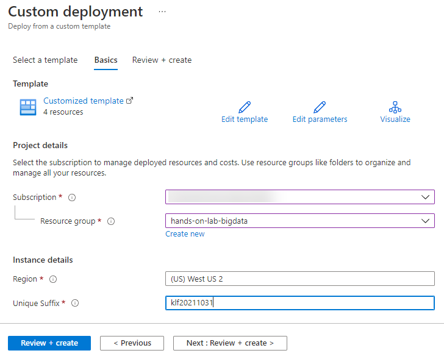

Big data analytics and visualization

Before the hands-on lab setup guide

November 2022

Information in this document, including URL and other Internet Web site references, is subject to change without notice. Unless otherwise noted, the example companies, organizations, products, domain names, e-mail addresses, logos, people, places, and events depicted herein are fictitious, and no association with any real company, organization, product, domain name, e-mail address, logo, person, place or event is intended or should be inferred. Complying with all applicable copyright laws is the responsibility of the user. Without limiting the rights under copyright, no part of this document may be reproduced, stored in or introduced into a retrieval system, or transmitted in any form or by any means (electronic, mechanical, photocopying, recording, or otherwise), or for any purpose, without the express written permission of Microsoft Corporation.

Microsoft may have patents, patent applications, trademarks, copyrights, or other intellectual property rights covering subject matter in this document. Except as expressly provided in any written license agreement from Microsoft, the furnishing of this document does not give you any license to these patents, trademarks, copyrights, or other intellectual property.

The names of manufacturers, products, or URLs are provided for informational purposes only and Microsoft makes no representations and warranties, either expressed, implied, or statutory, regarding these manufacturers or the use of the products with any Microsoft technologies. The inclusion of a manufacturer or product does not imply endorsement of Microsoft of the manufacturer or product. Links may be provided to third party sites. Such sites are not under the control of Microsoft and Microsoft is not responsible for the contents of any linked site or any link contained in a linked site, or any changes or updates to such sites. Microsoft is not responsible for webcasting or any other form of transmission received from any linked site. Microsoft is providing these links to you only as a convenience, and the inclusion of any link does not imply endorsement of Microsoft of the site or the products contained therein.

© 2021 Microsoft Corporation. All rights reserved.

Microsoft and the trademarks listed at <https://www.microsoft.com/en-us/legal/intellectualproperty/Trademarks/Usage/General.aspx> are trademarks of the Microsoft group of companies. All other trademarks are property of their respective owners.

**Contents**

<!-- TOC -->

- [Big data analytics and visualization before the hands-on lab setup guide](#big-data-analytics-and-visualization-before-the-hands-on-lab-setup-guide)
  - [Requirements](#requirements)
  - [Before the hands-on lab](#before-the-hands-on-lab)
    - [Task 1: Create an Azure resource group using the Azure Portal](#task-1-create-an-azure-resource-group-using-the-azure-portal)
    - [Task 2: Deploy Azure resources](#task-2-deploy-azure-resources)
    - [Task 3: Configure Databricks access to Azure Data Lake Storage](#task-4-configure-databricks-access-to-azure-data-lake-storage)
    - [Task 4: Download and install Power BI Desktop](#task-3-download-and-install-power-bi-desktop)
    
   

<!-- /TOC -->

# Big data analytics and visualization before the hands-on lab setup guide

## Requirements

1. Microsoft Azure subscription must be pay-as-you-go or MSDN.

   - Trial subscriptions will not work.

2. If you are not a Service Administrator or Co-administrator for the Azure subscription, or if you are running the lab in a hosted environment, you will need to install [Visual Studio 2022 Community](https://visualstudio.microsoft.com/downloads/) with the **ASP.NET and web development** and **Azure development** workloads.

## Before the hands-on lab

Duration: 30 minutes

In this exercise, you will set up your environment for use in the rest of the hands-on lab. You should follow all the steps provided in the Before the Hands-on Lab section to prepare your environment _before_ attending the hands-on lab.

### Task 1: Create an Azure resource group using the Azure Portal

In this task, you will use the Azure Portal to create a new Azure Resource Group for this lab.

1. Log into the [Azure Portal](https://portal.azure.com).

2. On the top-left corner of the portal, select the menu icon to display the menu.

    

3. In the left-hand menu, select **Resource Groups**.

4. At the top of the screen select the **+ New** option to add a new resource group.

   

5. Create a new resource group with the name **hands-on-lab-bigdata**, ensuring that the proper subscription and region nearest you are selected.  Once you have chosen a location, select **Review + Create**.

   

6. On the Summary blade, select **Create** to provision your resource group.

### Task 2: Deploy Azure resources

The below ARM template deploys several Azure resources for the labs, including Azure Synapse Analytics, Azure Database for PostgreSQL, storage accounts, Event Hubs, Stream Analytics, Key Vault, Azure Cosmos DB, Azure Machine Learning, etc.

1. Deploy the workspace through the following Azure ARM template (select the button below):

    

2. On the **Custom deployment** form fill in the fields described below.

   - **Subscription**: Select your desired subscription for the deployment.
   - **Resource group**: Select the resource group you previously created.
   - **Region**: The region where your Azure resources will be created.

   - **Unique Suffix**: This unique suffix will be used naming resources that will be created as part of your deployment, such as your initials followed by the current date in YYYYMMDD format (ex. `klf20211031`). Make sure you follow correct Azure [Resource naming](https://docs.microsoft.com/en-us/azure/cloud-adoption-framework/ready/azure-best-practices/naming-and-tagging#resource-naming) conventions.

   

3. Select the **Review + create** button, then **Create**. The provisioning of your deployment resources will take approximately 5 minutes.

### Task 3: Configure Databricks Access To Azure Data Lake Storage

TODO 

### Task 4: Download and install Power BI Desktop

Power BI desktop is required to connect to your Azure Databricks environment when creating the Power BI dashboard.

1. Download and install [Power BI Desktop](https://powerbi.microsoft.com/desktop/).

Note: You should follow all these steps provided _before_ attending the Hands-on lab.
